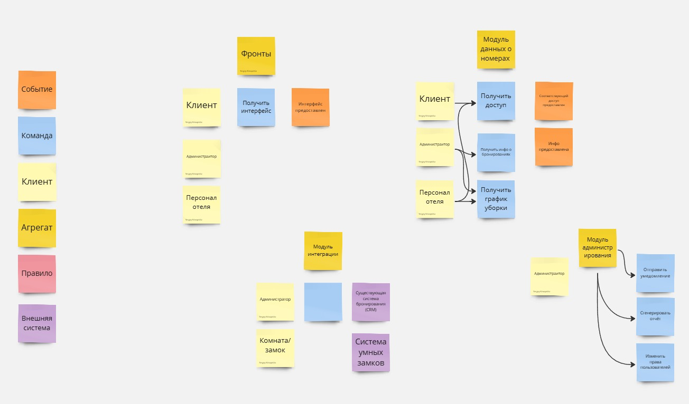

# Декомпозиция на функциональные компоненты
Кривопиша Сергей

Курс Software Architect

## Немного контекста
Это домашнее задание выполнено на основе ката, которая была использована и решена в предыдущем домашнем задании.

[Домашнее задание #1 (Анализ требований и подготовка архитектурному решению!)](homework_01.md)

**Бизнес-контекст**

Компания — крупный поставщик услуг по бронированию, стремящийся выйти на рынок премиум-класса, предлагая услуги для элитных курортов и спа-центров. Новый продукт, система бронирования и управления номерами, будет ориентирован на улучшение пользовательского опыта, предоставляя гостям удобный способ выбора номеров и усовершенствованные возможности для управления ресурсами отеля.

Конкурентные преимущества: вкладывает значительные средства в передовые технологии для создания уникального опыта и повышенного уровня безопасности и удобства для гостей. Кроме того, компания стремится оптимизировать внутренние процессы отелей, что важно для обеспечения качественного обслуживания.

Сроки: Система должна быть запущена до начала пикового сезона.

## Решение 1: Функциональная декомпозиция на основе пользовательских потоков (Use Case)

### Модель предметной области
В данном подходе функциональная декомпозиция основывается на сценариях использования, определяющих ключевые пользовательские потоки:
- Бронирование номера
- Управление статусами номеров
- Управление доступом к номерам
- Уведомления
- Аналитика и отчеты
  
Каждая из этих функций представляется как отдельный модуль или микросервис.

### Функциональная декомпозиция

1. Модуль бронирования
    - Поиск доступных номеров
    - Выбор номера и даты
    - Обработка оплаты
2. Модуль управления статусами
    - Статусы номеров (доступен, занят, на уборке)
    - Планирование уборки
    - Генерация приоритетов для персонала
3. Модуль управления доступом
    - Генерация виртуальных ключей
    - Предоставление доступа по запросу
    - Интеграция с API замков
    - Обновление ключей при изменении бронирования
4. Модуль уведомлений
    - Уведомления гостей о статусе бронирования
    - Уведомления персонала о задачах
5. Модуль аналитики
    - Отчеты о загрузке номеров
    - Анализ производительности персонала
    - Выявление узких мест
  
### Сценарии изменений

1. Добавление нового способа оплаты (например, криптовалюта)
    - Затрагивает только модуль бронирования
    - Оценка вероятности: высокая, тренды рынка
    - Ожидаемая стоимость изменений: низкая, требует лишь обновления логики обработки платежей

2. Расширение аналитики для добавления прогноза загрузки номеров
    - Затрагивает только модуль аналитики
    - Оценка вероятности: средняя
    - Ожидаемая стоимость изменений: средняя, потребуется обработка дополнительных данных

4. Изменение логики управления уборкой (например, ввод роботов-уборщиков)
    - Затрагивает модуль управления статусами
    - Оценка вероятности: низкая
    - Ожидаемая стоимость изменений: высокая, из-за переписывания логики и интеграции с новым оборудованием

### Оценка модифицируемости
Высокая, поскольку модули относительно изолированы. Изменения в одном модуле минимально затрагивают остальные.

## Решение 2: Декомпозиция на основе технических доменов (Technical Domain)

### Модель предметной области
В данном подходе функции группируются по техническим доменам, обеспечивая разделение ответственности между сервисами:
- Управление пользовательским интерфейсом
- Управление данными о номерах
- Управление платежами
- Интеграция с внешними системами
- Администрирование и аналитика

### Функциональная декомпозиция

1. Модуль UI
   - Интерфейс для гостей
   - Интерфейс для персонала
2. Модуль данных о номерах
   - Статусы номеров
   - Информация о бронированиях
3. Модуль интеграции
   - Интеграция с системой замков
   - Интеграция с CRM отеля
4. Модуль администрирования
   - Уведомления
   - Генерация отчетов
   - Управление пользователями

### Сценарии изменений

1. Изменение интерфейса (например, добавление новых фильтров поиска номеров)
    - Затрагивает только модуль UI
    - Оценка вероятности: высокая
    - Ожидаемая стоимость изменений: низкая, изменения локализованы в интерфейсе
2. Изменение системы замков (например, переход на другого поставщика)
    - Затрагивает только модуль интеграции
    - Оценка вероятности: средняя
    - Ожидаемая стоимость изменений: средняя, потребуется обновление API
3. Добавление новых отчетов для администраторов
    - Затрагивает модуль администрирования
    - Оценка вероятности: высокая
    - Ожидаемая стоимость изменений: низкая, добавление новых запросов к базе данных

### Оценка модифицируемости:
Средняя, поскольку изменения в одной функции могут затронуть другие модули (например, изменения в данных о номерах могут повлиять на UI).

## Решение 3: Декомпозиция по функциональным областям (Functional Area)
### Модель предметной области
В этом подходе функциональные области группируются по бизнес-функциям, каждая из которых отвечает за специфические аспекты работы системы. Это позволяет сосредоточить внимание на задачах, выполняемых бизнесом.
- Область бронирования
    - Управление бронированиями
    - Обработка запросов на отмену или изменение
- Область управления номерами
    - Обновление статусов номеров
    - Генерация приоритетов для уборки
- Область взаимодействия с гостями
    - Уведомления гостей
    - Доступ к номерам через мобильные устройства
- Область персонала
    - Уведомления и задачи для персонала
    - Мониторинг выполнения задач

### Функциональная декомпозиция:
1. Модуль бронирования
2. Модуль управления номерами
3. Модуль взаимодействия с гостями
4. Модуль персонала
   
### Сценарии изменений:
1. Добавление новых статусов номеров (например, "подготовка к мероприятию")
    - Затрагивает область управления номерами
    - Оценка вероятности: средняя
    - Стоимость изменений: низкая
2. Обновление логики уведомлений гостей (например, добавление персонализированных рекомендаций)
    - Затрагивает область взаимодействия с гостями
    - Оценка вероятности: высокая
    - Стоимость изменений: средняя
3. Введение новой аналитики для мониторинга задач персонала
    - Затрагивает область персонала
    - Оценка вероятности: низкая
    - Стоимость изменений: высокая

### Оценка модифицируемости:
Средняя. Декомпозиция хорошо отражает бизнес-логические области, но изменения внутри функциональной области могут затрагивать несколько модулей.

## Сравнительный анализ
| Критерий                | Use Case | Technical Domain | Functional Area |
| :---------------------- | :------: | :--------------: | :-------------: |
| Модифицируемость        | Высокая  | Средняя          | Средняя         | 
| Локализация изменений	  | Хорошая  | Частичная        | Средняя         | 
| Гибкость                | Высокая  | Средняя          | Высокая         | 
| Легкость интеграции	    | Средняя  | Высокая          | Средняя         | 
| Сложность разработки	  | Средняя  | Низкая           | Средняя         |
| Сложность сопровождения | Низкая   | Средняя          | Средняя         |
| Ориентация на бизнес	  | Средняя  | Низкая           | Высокая         |

## Вывод
- Декомпозиция по пользовательским потокам (Use Case) обладает лучшей модифицируемостью и гибкостью, что делает её предпочтительнее для сложных систем с частыми изменениями
- Техническая декомпозиция подходит для начальных стадий разработки, когда важно минимизировать сложность, но в долгосрочной перспективе может привести к трудностям в сопровождении.
- Декомпозиция по функциональным областям хорошо отражает бизнес-логику, но может вызывать проблемы с локализацией изменений из-за пересечения функциональности между модулями.

## Рекомендуемое решение
**Декомпозиция по пользовательским потокам**, поскольку она обеспечивает наилучший баланс между гибкостью, локализацией изменений и простотой сопровождения, что особенно важно для системы, которая ориентируется на высокие стандарты качества.
