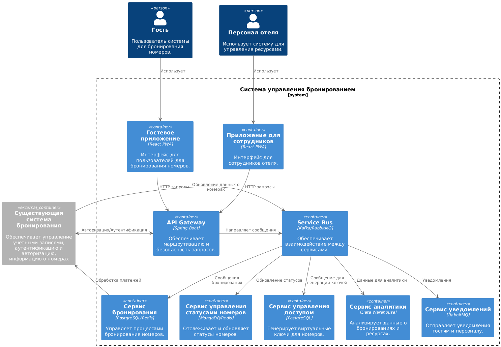
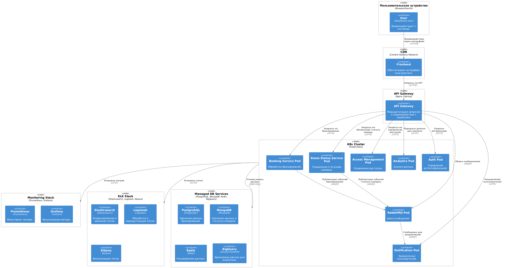

# Взаимодействие сервисов
Кривопиша Сергей

Курс Software Architect

## Немного контекста
Это домашнее задание выполнено на основе ката, которая была использована и рассматривалась в предыдущем домашнем задании - ката Нила Форда, а именно Room with a View: https://nealford.com/katas/kata?id=RoomWithAView

[Домашнее задание #1 (Анализ требований и подготовка архитектурному решению)](homework_01.md)  
[Домашнее задание #2 (Декомпозиция на функциональные компоненты)](homework_02.md)  
[Домашнее задание #3 (Взаимодействие сервисов)](homework_03.md)

**Контекст**

Компания — крупный поставщик услуг по бронированию, стремящийся выйти на рынок премиум-класса, предлагая услуги для элитных курортов и спа-центров. Новый продукт, система бронирования и управления номерами, будет ориентирован на улучшение пользовательского опыта, предоставляя гостям удобный способ выбора номеров и усовершенствованные возможности для управления ресурсами отеля.

Система бронирования и управления номерами отеля включает в себя несколько ключевых сервисов, которые взаимодействуют друг с другом для обеспечения функциональности и улучшения пользовательского опыта. Важно, чтобы архитектура была гибкой, масштабируемой и легко модифицируемой, что позволяет адаптировать систему под будущие изменения и улучшения.

В данном домашнем задании мы построим диаграмму контейнеров приложения, декомпозируем слой данных с учетом хранения в подходящих БД, а также постороим деплоймент-диаграмму для отображения развертывания на инфраструктурных компонентах.

### Диаграмма контейнеров приложения
На основе функциональной декомпозиции системы, ключевые контейнеры включают:

#### 1. **Frontend**
  - Веб и мобильное приложение для гостей и персонала.
  
#### 2. **Сервис бронирования**
  - API для поиска номеров, бронирования и оплаты.
  - Управление транзакциями с интеграцией с внешними платежными шлюзами.

#### 3. **Сервис управления статусами номеров**
  - Управление состоянием номеров (доступен, занят, на уборке).
  - Планирование задач для персонала.

#### 4. **Сервис управления доступом**
  - Генерация и обновление виртуальных ключей.
  - Интеграция с системами замков.

#### 5. **Сервис уведомлений**
  - Генерация уведомлений для гостей и персонала.
  - Поддержка многоканальных уведомлений (email, SMS, push).

#### 6. **Сервис аналитики**
  - Сбор и анализ данных.
  - Генерация отчетов.

#### 7. **Система авторизации и аутентификации (Auth)**
  - Управление пользователями, доступами и ролями.

#### 8. **Общая шина данных (Event Bus)**
  - Асинхронное взаимодействие между сервисами.

### Декомпозиция слоя данных
Хранение данных распределено между специализированными базами данных для обеспечения оптимальной производительности:

#### 1. Сервис бронирования:
  - **Реляционная БД (PostgreSQL):** Хранение данных о бронированиях, транзакциях, клиентах.
  - **Кэш (Redis):** Кэширование доступности номеров для быстрого отклика.
#### 2. Сервис управления статусами номеров:
  - **NoSQL БД (MongoDB):** Хранение состояния номеров, задач для персонала.
  - **Кэш (Redis):** Оперативный доступ к текущим статусам номеров.
#### 3. Сервис управления доступом:
  - **Реляционная БД (PostgreSQL):** Хранение информации о ключах и правах доступа.
#### 4. Сервис уведомлений:
  - **Message Queue (RabbitMQ):** Обработка и доставка уведомлений.
#### 5. Сервис аналитики:
  - **Хранилище данных (Snowflake/Redshift):** Исторические данные для анализа.
#### 6. Сервис авторизации:
  - **Реляционная БД (PostgreSQL):** Пользователи, роли, права доступа.

### Диаграмма деплоймента

Диаграмма описывает, как компоненты системы развернуты в инфраструктуре, включая взаимодействие между ними. Основное внимание уделяется Kubernetes-кластеру, микросервисам, поддерживающим системам и внешним интеграциям.

#### 1. Взаимодействие с пользователем
- **User:**
  - Пользователь взаимодействует с фронтендом через браузер или мобильное приложение.
  - Отправляет HTTP-запросы на сервер, чтобы получить данные или выполнить операции (например, бронирование номеров).
- **Frontend (CDN):**
  - CDN (Content Delivery Network) используется для кеширования и быстрого предоставления статики (HTML, CSS, JS).
  - CDN ускоряет загрузку фронтенда для пользователей независимо от их географического положения.

#### 2. API Gateway
- Маршрутизация запросов (routing)
- Аутентификация и авторизация
- Логирование и мониторинг
- Ограничение скорости запросов (rate limiting) — защита от перегрузки системы.
- Трансформация данных — преобразование форматов запросов и ответов.

#### 3. Kubernetes-кластер ([K8s Cluster])
Все основные сервисы развернуты в виде контейнеров внутри Kubernetes-кластера. Kubernetes отвечает за:

#### 4. Взаимодействие с другими системами
**Managed DB Services:**
Внешние управляемые базы данных, такие как PostgreSQL, MongoDB, Redis и BigQuery. Kubernetes-кластер обращается к этим сервисам через сеть.

**Monitoring Stack (Prometheus, Grafana):**
Служит для мониторинга метрик системы и ее компонентов.
Позволяет наблюдать за загрузкой CPU, задержками запросов, состоянием Pods.

**ELK Stack:**
Система централизованного логирования для всех сервисов.
Используется для анализа и поиска ошибок.

### Преимущества такой архитектуры
**Масштабируемость:**  
Kubernetes-кластер позволяет автоматически увеличивать или уменьшать количество подов в зависимости от нагрузки.

**Разделение ответственности:**  
Каждый сервис изолирован и решает строго свою задачу.

**Отказоустойчивость:**  
Проблемы в одном поде не влияют на работу других подах.

**Легкость мониторинга и анализа:**  
Monitoring Stack и ELK Stack обеспечивают полное покрытие для отслеживания состояния системы и выявления проблем.

Эта архитектура обеспечивает надежность, масштабируемость и высокую доступность системы.
