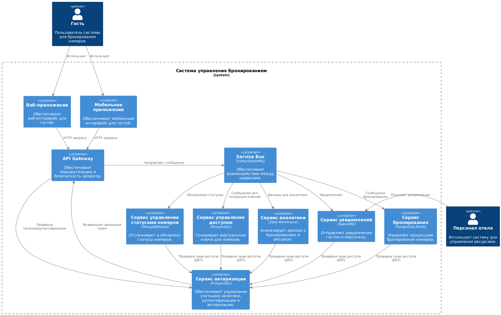

# Взаимодействие сервисов
Кривопиша Сергей

Курс Software Architect

## Немного контекста
Это домашнее задание выполнено на основе ката, которая была использована и рассматривалась в предыдущем домашнем задании - ката Нила Форда, а именно Room with a View: https://nealford.com/katas/kata?id=RoomWithAView

[Домашнее задание #1 (Анализ требований и подготовка архитектурному решению)](homework_01.md)\
[Домашнее задание #2 (Декомпозиция на функциональные компоненты)](homework_02.md) \
[Домашнее задание #3 (Взаимодействие сервисов)](homework_03.md)

**Контекст**

Компания — крупный поставщик услуг по бронированию, стремящийся выйти на рынок премиум-класса, предлагая услуги для элитных курортов и спа-центров. Новый продукт, система бронирования и управления номерами, будет ориентирован на улучшение пользовательского опыта, предоставляя гостям удобный способ выбора номеров и усовершенствованные возможности для управления ресурсами отеля.

Система бронирования и управления номерами отеля включает в себя несколько ключевых сервисов, которые взаимодействуют друг с другом для обеспечения функциональности и улучшения пользовательского опыта. Важно, чтобы архитектура была гибкой, масштабируемой и легко модифицируемой, что позволяет адаптировать систему под будущие изменения и улучшения.

В данном домашнем задании мы построим диаграмму контейнеров приложения, декомпозируем слой данных с учетом хранения в подходящих БД, а также постороим деплоймент-диаграмму для отображения развертывания на инфраструктурных компонентах.

### Диаграмма контейнеров приложения
На основе функциональной декомпозиции системы, ключевые контейнеры включают:

#### 1. **Frontend**
  - Веб и мобильное приложение для гостей и персонала.
  
#### 2. **Сервис бронирования**
  - API для поиска номеров, бронирования и оплаты.
  - Управление транзакциями с интеграцией с внешними платежными шлюзами.

#### 3. **Сервис управления статусами номеров**
  - Управление состоянием номеров (доступен, занят, на уборке).
  - Планирование задач для персонала.

#### 4. **Сервис управления доступом**
  - Генерация и обновление виртуальных ключей.
  - Интеграция с системами замков.

#### 5. **Сервис уведомлений**
  - Генерация уведомлений для гостей и персонала.
  - Поддержка многоканальных уведомлений (email, SMS, push).

#### 6. **Сервис аналитики**
  - Сбор и анализ данных.
  - Генерация отчетов.

#### 7. **Система авторизации и аутентификации (Auth)**
  - Управление пользователями, доступами и ролями.

#### 8. **Общая шина данных (Event Bus)**
  - Асинхронное взаимодействие между сервисами.

